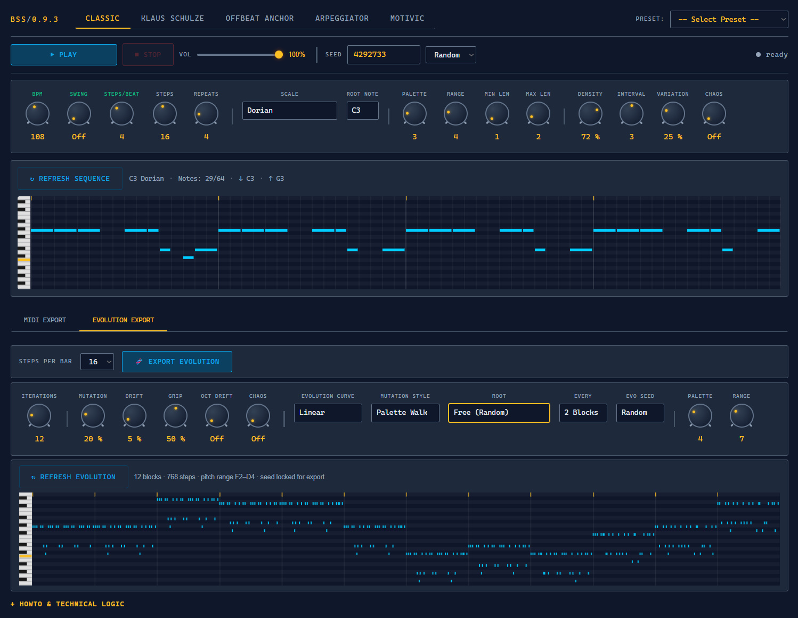
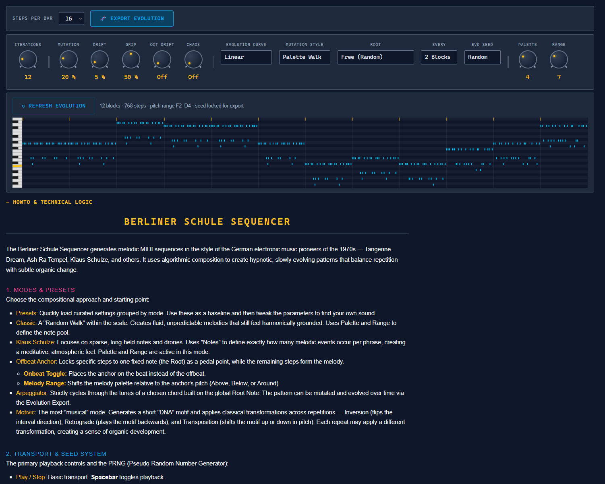

# Berliner Schule Sequencer (BSS)

An algorithmic MIDI sequencer that runs directly in the browser. It generates melodic patterns inspired by the **Berliner Schule** style of electronic music, balancing repetition with subtle organic evolution.

## 📸 Preview

| Interface | Howto |
| :---: | :---: |
|  |  |

## Core Functionality

The tool is designed as a sequence generator. While it includes a basic internal synth for monitoring and previewing patterns, its primary purpose is to generate MIDI data. The actual sound design and final music production are intended to take place within a **Digital Audio Workstation (DAW)** or with external hardware via the MIDI export function.

The tool uses a Pseudo-Random Number Generator (PRNG) to create sequences based on musical constraints. Users can either generate random patterns or use fixed seeds to recreate specific results.

### Composition Modes
- **Classic**: A random walk within the selected scale, creating fluid and grounded melodies.
- **Klaus Schulze**: Focuses on sparse, long-held notes and drones for a meditative atmosphere. Note count is set explicitly rather than by density.
- **Offbeat Anchor**: Locks specific steps to a fixed pedal point while the rest of the melody varies. The anchor pattern, position (on- or offbeat), and melody range relative to the anchor are all configurable.
- **Arpeggiator**: Cycles through chord tones in ascending, descending, ping-pong, or random order across 1–3 octaves. Supports triads, seventh chords, and extensions.
- **Motivic**: Generates a short "DNA motif" and applies classical transformations (inversion, retrograde, transposition) across repeats.

### Harmonic Palette (Scales)
Six standard scales (Dorian, Phrygian, Aeolian, Mixolydian, Minor/Major Pentatonic) plus four dystopic modes (Locrian, Whole Tone, Half-Whole Diminished, Chromatic).

### Presets
A selection of ready-made presets referencing classic Berliner Schule albums and sounds for quick starting points.

### Parameters
- **Palette & Range**: Define which notes are available — Palette sets the number of scale tones in the active pool; Range sets the pitch corridor around the root.
- **Density**: Probability that a note occurs on any given step.
- **Interval**: Maximum melodic jump between consecutive notes (in scale steps).
- **Variation**: How much each repeat of the phrase differs from the original — adds organic, non-robotic movement.
- **Chaos**: Injects chromatic foreign tones into the palette and widens the pitch and interval constraints. Works independently for the main sequencer and the evolution export. Can break scale constraints intentionally.

### Evolutionary Export (🧬)
Beyond standard MIDI loops, the sequencer features an evolutionary chain generator that creates long-form compositions by mutating a sequence across multiple blocks:

- **Iterations**: Number of mutation blocks (1–64).
- **Mutation**: How many notes change per block — controls speed of divergence from the original.
- **Drift**: Probability of a sudden octave jump between blocks.
- **Oct Drift**: Gradual octave drift that accumulates across blocks, distinct from the sudden jumps of Drift.
- **Grip**: How strongly the evolution is pulled back toward the original theme.
- **Chaos**: Same chromatic contamination as the main sequencer, applied independently to the evolution chain.
- **Evolution Curve**: Shapes mutation intensity over time — Linear, Ramp Up, Arch, Valley, Ease In/Out.
- **Mutation Style**: Palette Walk (adjacent steps), Palette Random (any tone), or Mix.
- **Root Mode**: Controls whether and how the tonal centre shifts across blocks. Includes static, free/random, interval-based (Thirds, 4ths/5ths, Cycle of Fifths), Berliner Schule/Ambient (Modal, Circulating Fifths, Slow Oscillation), and Pop/Rock/Standards presets (50s, Andalusian, Jazz Standard, Pachelbel, etc.).
- **Evo Seed Mode**: Fixed (reproducible) or Random (fresh chain on each refresh).

A live preview canvas shows the full evolutionary arc before export.

## Installation & Usage

No installation required.
1. Download or clone the repository.
2. Open `berliner-schule-sequencer.html` in any modern web browser.

## Operation Guide

### Parameter Behaviour
- **Live Parameters (Green Labels)**: Affect playback in real-time (BPM, Swing, Steps per Beat). Changes are audible immediately.
- **Generative Parameters (Amber Labels)**: Define the blueprint of the sequence. Changing these triggers automatic regeneration on slider release or selection change. The **↻ Generate** button manually triggers a new pattern with the current seed.

### Visual Legend
- **Blue cell**: Standard generated note.
- **Pink cell**: Anchor note (fixed pitch).
- **Dark / empty cell**: A rest.
- **Semi-transparent blue**: A tie (held note).
- **Blue height bar**: Relative pitch indicator.

## License
Berliner Schule Seqencer is free and open source.
MIT License © 2026 Reiner Prokein
